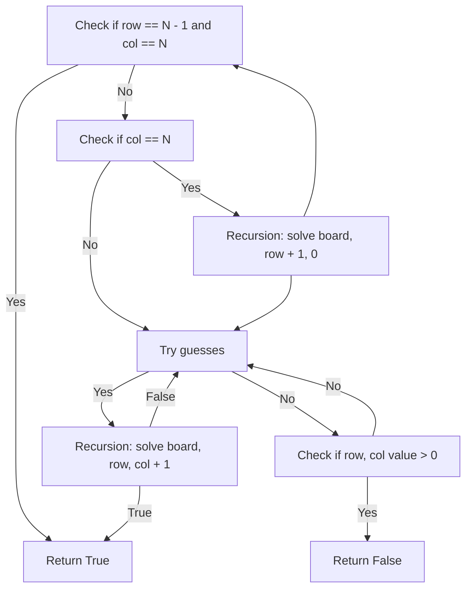

# CS 3102 ASSIGNMENT

## Task

Create a working program that solves a 5x5 sudoku board

## Objectives

- Users should be able to choose 5 cells from the board
- Place numbers 1-5 randomly in chosen 5 cells
- Use Brute Force Algorithm as basis to create a sudoku solver

## Table of Contents

1. [Prerequisites](#prerequisites)
    1. [Libraries](#libraries)
2. [Installation](#installation)
3. [Usage](#usage)
4. [Code Description](#code-description)
    1. [Variables](#variables)
    2. [Functions](#functions)
5. [References](#references)

## Prerequisites

- Python 3.x

### Libraries

- Pygame

## Installation

1. Clone or download the respository
2. Verify Python installation using `python -v` ( Make sure it's version Python 3.x )
3. Create a virtual environment
    1. Use command `python -m venv env`
    2. Activate virtual environment
        - Windows
            - `env/Scripts/activate`
        - Other OS
            - `source env/bin/activate`
4. Install requirements using `pip install -r requirements.txt`

## Usage

1. For terminal version
    1. Use `python main.py` to run
    2. Program will ask for cell coordinates
        - Input in style of (x,y) where x is row and y is column
    3. Program will solve the rest
2. For Pygame version
    1. Use `python gui.py` to run
    2. Click on 5 tiles in the board
    3. Press Spacebar
    4. Program will fill in the blanks

## Code Description

### Variables

```python
N: int
    desc:
        number of rows and column together

board: list[list[int]]
    desc:
        5x5 board in the form of a matrix
    ex:
        [
            [0,0,0,0,0],
            [0,0,0,0,0],
            [0,0,0,0,0],
            [0,0,0,0,0],
        ]
cell: list[int]
    desc:
        contains row and col values
    ex:
        [0,0]

guess: int
    desc:
        contains guess for cell
```

### Functions

```python
def solve(board, cell):
    """
        Recursive function that fills in the empty cells
    """
```

```python
def valid(board, cell, guess):
    """
        Checks if guess is valid
    """
```

```python
def display_board(board):
    """
        Displays the board in a pretty format
    """
```

### Diagrams

`Solve Function`



## References

[Brute-Force-Sudoku-Solver](https://github.com/bgrohman/Brute-Force-Sudoku-Solver/blob/master/SudokuSolver.py)
[GeeksForGeeks Sudoku-Solver](https://www.geeksforgeeks.org/sudoku-backtracking-7/)

> PS - i have no idea if this uses brute force algorithm but hey i have an output to show :)
